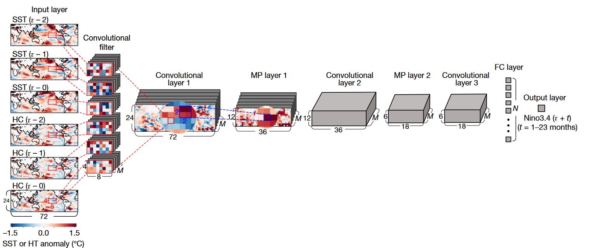
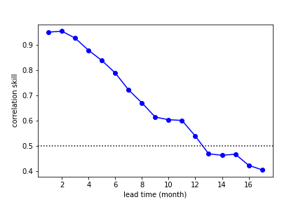
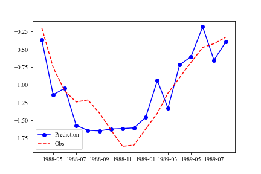
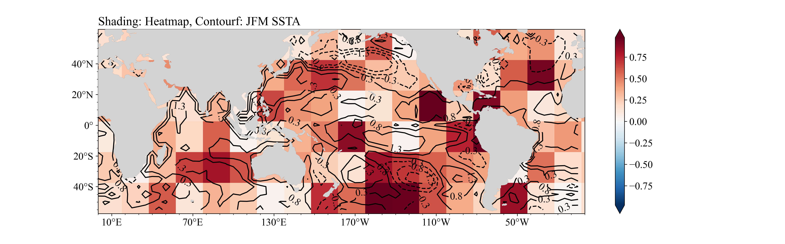
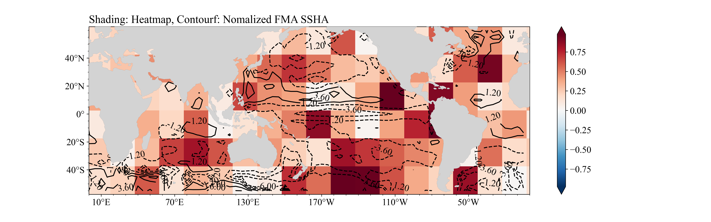

# Deep learning for multi-year ENSO forecasts Reproduction

Author: Zilu Meng

DOI: https://doi.org/10.1038/s41586-019-1559-7

Original Author:　Yoo-Geun Ham1*, Jeong-Hwan Kim1 & Jing-Jia Luo2,3

## Desciption

This is the project to reproduce Ham et al. 2019's work.

The first version was finished in 2020. (Also it can be looked in ./old)

In 2022, I rewrite all the codes and use **Tensorflow** to finish all the work.

Hoping to help you.

## Data and code

If you don't want to download CMIP data and meteorological data, you can use the meteorological data in the **./data** folder. 

The [data](./data) in **./data** folder is processed according to the original paper (Ham et al. 2019). How to use the data can refer to [load_data.py](./main/load_data.py) and [Network.ipynb](./main/Network.ipynb), [heatmap_allnet.ipynb](./main/heatmap.ipynb) in the **./main** folder

## Abstact

The research on the causes and antecedents of El Nino and La Nina has always been the focus of ENSO research. This paper will use convolutional neural network and grad cam's visual thermal map to further study the cause of El Nino (La Nina). We first established a convolutional neural network to predict the nino3.4 index, and the prediction skills reached 13 months. Then it makes it predict the La Nina event in 88 / 89, and draws a thermal map to further reveal that the early spring signals of La Nina mainly include the tropical Indian Ocean and the tropical Atlantic Ocean.

## Preface

Can the convolutional neural network, which has emerged recently, tell us more about the causes of El Nino and La Nina from a new perspective? We mainly refer to the article * * Deep Learning for multi year ENSO forecasts * * (Ham et al. 2019) published by ham et al in nature in 2019 to reproduce the relevant steps of the original article and complete this project.

And this project is also the subsequent expansion and tensorflow version of project (https://zhuanlan.zhihu.com/p/435607626) . Pytorch version can view the original project.

## Construction of neural network

Referring to the neural network constructed by Ham et al. 2019, we constructed the following neural network to predict the nino3.4 index. Different from the original paper, we did not use HC as the input data, but used the sea height (SSH) which is approximately linear with HC as the input data. The output data is the nino3.4 index in the next 17 months.



The code is as follows:

```Python
from tensorflow.keras import datasets, layers, models
import tensorflow as tf


model = models.Sequential(name="ENSO")
model.add(layers.Conv2D(50, (4, 8), activation="tanh", padding="same", input_shape=ip_train.shape[1:]))
model.add(layers.MaxPool2D((2, 2)))
model.add(layers.Conv2D(50, (4, 8), activation="tanh", padding="same"))
model.add(layers.MaxPool2D((2, 2)))
model.add(layers.Conv2D(50, (4, 8), activation="tanh", padding="same"))
model.add(layers.Flatten())
model.add(layers.Dense(50, activation="tanh"))
model.add(layers.Dense(17))
model.summary()

```

## Training and forecasting skills of neural networks

For training data, we use cmip6 mode data and observation data (SST: hadlsst, SSH: soda, Godas). See the appendix or project for data preprocessing https://zhuanlan.zhihu.com/p/435606727 .

In terms of training, the SGD was used to train 20 epochs, bitch_sizesize is set to 400
The training code is as follows:

```Python
model.compile(optimizer=keras.optimizers.SGD(), loss="mse")
hist = model.fit(ip_train, nino34_train, validation_data=(ip_var, nino34_var), epochs=20, batch_size=400)
model.save("../data/model/exp2_pretrain")

```

After the training, we tested the prediction skills of the network, as shown in the following figure. It can be seen that the 12-month effective forecast can be achieved with the correlation coefficient of 0.5 as the standard. A good prediction effect is achieved.



## Grad CAM analysis and prediction signal source

Since the convolution in the neural network is equivalent to the extraction of SST and SSH by the filter, the output of the last convolution network is the feature extraction of the input data by the convolution layer, which is called the feature map here.


There is a spatial one-to-one correspondence between the feature map and the original data, so the filtering of the convolution network on the original data can be viewed through the feature map.

However, the number of characteristic maps finally obtained is the number of filters (50 in this network). Therefore, it is necessary to determine the weight of each characteristic map and then add them to obtain a thermodynamic map, as shown in the following formula $H$ is the final Heatmap, the shape is consistent with the space size of the final output of the convolution network, $a$ is the feature map, $w$ is the weight of each feature map.

$$
H = \sum_{i=1}^{filter \ num} w_i A_i
$$

The Grad-cam algorithm (Selvaraju et al. 2020) is used to determine the weight. The detailed algorithm process can be viewed in the original paper. The formula for determining the weight is as follows, and the nino3.4 index predicted by Y neural network is as follows:

$$
w_i = global \ average \ pooling ( \frac{ \partial y}{ \partial A_i})
$$

The implementation method using tensorflow is as follows:

```Python
from tensorflow.python.ops.numpy_ops import np_config
np_config.enable_numpy_behavior()


# load model
model = keras.models.load_model("../data/model/exp2_pretrain") 
# build model to get heatmap
last_conv_layer_name = "conv2d_2" # 最后一层卷积层的名字
grad_model = tf.keras.models.Model(
    [model.inputs], [model.get_layer(last_conv_layer_name).output, model.output]
)
grad_model.summary()

# get gradient
with tf.GradientTape() as tape:
    last_conv_layer_output, preds = grad_model(ip_data[[8]])
    class_channel = preds[:,9] # Here, 9 is the last output channel. We want to calculate the nino3.4 index of the tenth month, so we use [:, 9]
# differentiate
grads = tape.gradient(class_channel, last_conv_layer_output)
# global  average  pooling
pooled_grads = tf.reduce_mean(grads, axis=(0, 1, 2))
# calculate 
last_conv_layer_output = last_conv_layer_output[0]
# Weight * feature graph and sum
heatmap = last_conv_layer_output @ pooled_grads[..., tf.newaxis]
heatmap = tf.squeeze(heatmap)
# absolute
heatmap = np.abs(heatmap)
# normalize
heatmap = heatmap/heatmap.max()

```

We use the super La Nina in 1988 / 1989 as an example to analyze the forecast signal of the spring before La Nina.
Input data we use the SST and SSH data from January to March in 1988 to predict the nino3.4 index in the next 17 months, and draw Heatmap based on the prediction of nino3.4 index in January 1989.
First, we use neural network to carry out prediction experiment, and the predicted nino3.4 index and observation are as follows. It can be seen that our neural network can well predict the development process of the La Nina event.



The drawn Heatmap is shown in the following figure. In the first figure, shading is Heatmap, and the isoline is SSTA of JFM; In the second figure, shading is Heatmap, and the isoline is SSHA of JFM.





## Heatmap result analysis

First, the Pacific is the region with the most significant signal. The negative sea surface height (thermocline) anomalies in the central Pacific and the Northwest Pacific indicate that the thermocline in the equatorial Pacific is at a shallow level, which is conducive to the development of La Nina in the future. The positive sea surface temperature anomaly in the East Pacific further makes the thermocline depth shallower. (Jin 1997; Li 1997)

At this time, the Indian Ocean is in a positive SST anomaly, and the east wind triggered by it in the Western Pacific is also conducive to the development of La Nina event. (Xie et al. 2016)

While the abnormal warm sea surface temperature in the Atlantic Ocean is conducive to triggering the eastward Kelvin wave, which is transmitted over the Pacific Ocean with the assistance of the Indian Ocean, and the easterly anomaly is conducive to causing the La Nina event (Jiang and Li 2021).

## Summary

This paper explores the causes of El Niño and La Niña phenomena by constructing neural networks and drawing Heatmap. Taking the La Niña event in 1988 / 1989 as an example, it analyzes the reasons why neural networks can successfully predict and the physical mechanism of the occurrence of La Niña. This work can be regarded as an after-school assignment of the author, and it is also full of loopholes. I hope you can forgive me!

## Acknowledgement

I am very grateful to researcher Zheng Fei of the Institute of Atmospheric Physics of the Chinese Academy of Sciences for his guidance on this project, and also to Professor Chen Lin, doctoral students Sun Ming, Professor Luo Jingjia, postgraduate students Yang Song and Professor Li Tim of NUIST for their help.

## References

Ham, Y.-G., J.-H. Kim, and J.-J. Luo, 2019: Deep learning for multi-year ENSO forecasts. Nature, 573, 568–572, https://doi.org/10.1038/s41586-019-1559-7.


Jiang, L., and T. Li, 2021: Impacts of Tropical North Atlantic and Equatorial Atlantic SST Anomalies on ENSO. Journal of Climate, 34, 5635–5655, https://doi.org/10.1175/JCLI-D-20-0835.1.
Jin, F.-F., 1997: An Equatorial Ocean Recharge Paradigm for ENSO. Part I: Conceptual Model. JOURNAL OF THE ATMOSPHERIC SCIENCES, 54, 19.


Li, T., 1997: Phase Transition of the El Niño–Southern Oscillation: A Stationary SST Mode. Journal of the Atmospheric Sciences, 54, 2872–2887, https://doi.org/10.1175/1520-0469(1997)054<2872:PTOTEN>2.0.CO;2.


Selvaraju, R. R., M. Cogswell, A. Das, R. Vedantam, D. Parikh, and D. Batra, 2020: Grad-CAM: Visual Explanations from Deep Networks via Gradient-based Localization. Int J Comput Vis, 128, 336–359, https://doi.org/10.1007/s11263-019-01228-7.


Xie, S.-P., Y. Kosaka, Y. Du, K. Hu, J. S. Chowdary, and G. Huang, 2016: Indo-western Pacific ocean capacitor and coherent climate anomalies in post-ENSO summer: A review. Adv. Atmos. Sci., 33, 411–432, https://doi.org/10.1007/s00376-015-5192-6.

## Appendix

For data preprocessing, if there is no ready-made cmip6 data, you can directly use the data file in GitHub as the processed file. Use ./code/load_data.py ,data can be loaded.
The data processing process mainly uses **CDO** to process. 